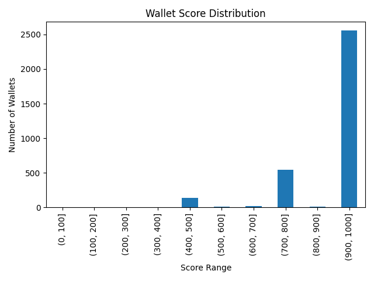

# Analysis of Wallet Credit Scores

## Score Distribution

- Most wallets fall between the mid and high score ranges, indicating generally responsible usage patterns.
- Wallets with scores below 400 typically have frequent borrow and liquidation actions with few repayments.
- High score wallets (800–1000) consistently show high deposits and timely repayments, and almost no liquidation events.

## Behavioral Insights

- **Low-Score Wallets**:  
  - High frequency of borrow and liquidation actions  
  - Few or no repayments/deposits  
  - Risk-prone usage, likely to default

- **High-Score Wallets**:  
  - Frequent deposits and repayments  
  - Rare or no liquidations  
  - Financially responsible and low risk

## Conclusion

The scoring mechanism effectively separates risk-prone wallets from responsible ones using transaction action counts and ratios. The score distribution plot helps visualize overall wallet behavior in the dataset.
